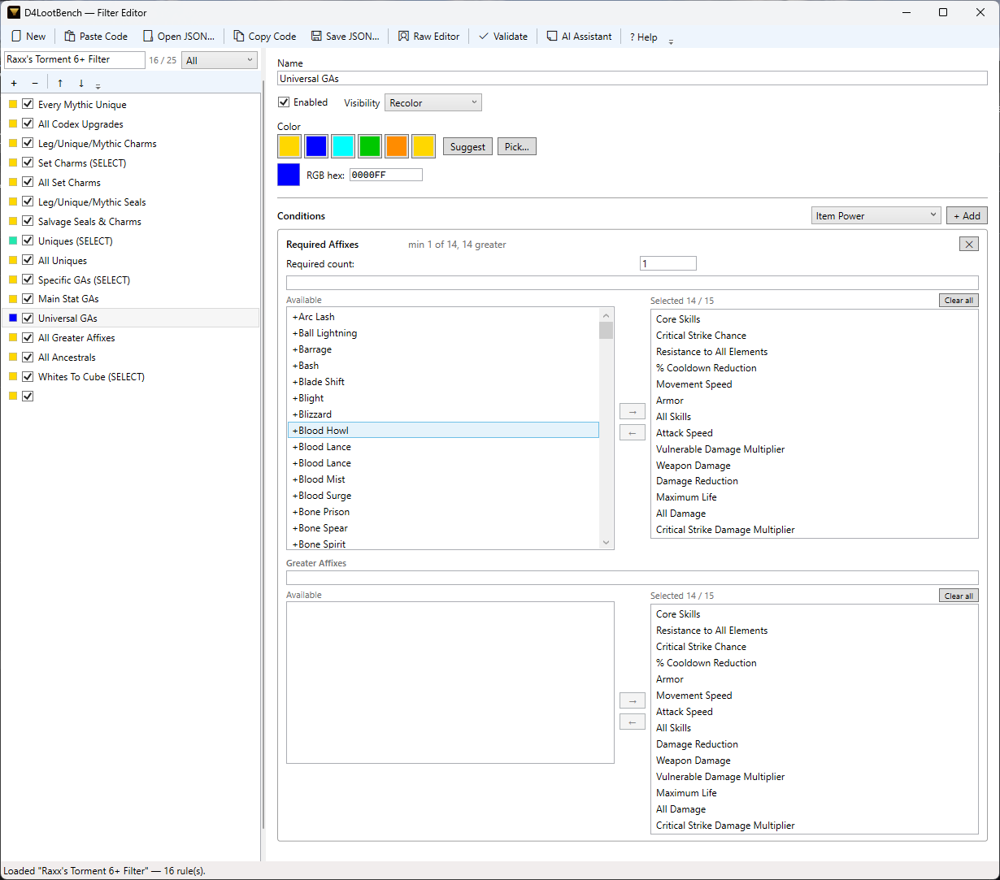

# FilterForge

> A desktop editor for Diablo IV loot filter share codes — import, edit visually, export back to the game.

D4's in-game filter UI is functional but tedious for anything beyond the simplest rules. FilterForge lets you import a share code, edit all its rules with a proper visual editor, and export a new share code to paste back into the game.


*(screenshot coming soon)*

---

## Download

**[Download the latest release →](../../releases/latest)**

Single `.exe`, no installer, Windows only. Copy it anywhere and run it.

> **First run:** Windows SmartScreen may warn that the file is from an unknown publisher. This is expected for unsigned community tools — click **More info → Run anyway** to proceed.

---

## What It Does

- Import any D4 loot filter share code
- Add, remove, reorder, and edit rules with a full visual editor
- Edit all condition types: rarity, item power, affixes, greater affixes, codex of power, item types, unique items, talisman sets, and item properties
- Color-code rules with a full HSV color picker
- Export back to a share code to paste into D4
- Raw JSON editor for bulk edits and power users
- Optional AI assistant (Ollama) — describe a rule in plain English, get a filter rule back

---

## Usage

1. Open D4's in-game **Loot Filter** menu → select your filter → **Share** → copy the share code
2. Paste the code into FilterForge
3. Edit rules and conditions in the visual editor (or switch to the Raw JSON editor)
4. Click **Copy Code** → paste back into D4's share code field

---

## AI Rule Assistant

The AI assistant is an opt-in feature — FilterForge works fully without it.

**Recommended setup: [Ollama](https://ollama.com) (free, runs locally)**

1. Install Ollama from [ollama.com](https://ollama.com)
2. Pull a model (see table below): `ollama pull qwen2.5-coder:7b`
3. Open FilterForge → click the **AI** button in the toolbar to expand the panel
4. Set **Base URL** to `http://localhost:11434` and **Model** to the name you pulled

Then describe what you want in plain English, e.g. *"show all ancestral items with a greater affix"*, and the assistant will generate a filter rule you can review before adding.

**Recommended models**

| Model | VRAM | Notes |
|-------|------|-------|
| `qwen2.5-coder:7b` | ~4 GB | Best balance of quality and speed; strong structured JSON output — recommended starting point |
| `qwen2.5-coder:14b` | ~9 GB | Higher quality rule generation; tested and confirmed working |
| `llama3.2` | ~2 GB | Runs on CPU if you have no GPU; output quality is lower for structured tasks |

> Models not listed here may work but have not been tested. Coder-focused models generally produce better results for this task since the output is structured JSON.

> Cloud providers (Anthropic, OpenAI) are not yet wired into the UI. The provider abstraction is in place and may be added based on community interest.

---

## Customizing Game Data

FilterForge embeds a copy of `d4-data.json` — the database of affix names, item types, unique items, skills, and talisman sets used to populate the editor pickers.

To edit it (e.g. to add a newly released item or correct a name):

1. **File → Export d4-data.json** — writes the embedded file next to `FilterForge.exe`
2. Edit the file with any text editor
3. Restart FilterForge — the local copy takes precedence over the embedded one

See [docs/d4-data-format.md](docs/d4-data-format.md) for the full schema reference. Community corrections are welcome — see [CONTRIBUTING.md](CONTRIBUTING.md).

---

## Troubleshooting

**Filter code won't import / produces unexpected results**
Re-export the filter from D4's in-game UI instead of using a code shared externally. Codes shared via community sites or older tools may have subtle encoding differences from the current game version.

**AI assistant not responding**
Verify Ollama is running (`ollama list` in a terminal). Confirm the **Base URL** in the AI panel matches your Ollama port — the default is `http://localhost:11434`.

---

## Building from Source

Requires [.NET 10 SDK](https://dotnet.microsoft.com/download).

```powershell
dotnet build                    # build the full solution
dotnet test                     # run the test suite (58 tests)

# produce a self-contained single-file exe
dotnet publish src/FilterForge.App -r win-x64 -p:PublishSingleFile=true --self-contained true
```

---

## Architecture

For those interested in the implementation:

- **Custom protobuf codec** (~80 lines, 3 wire types) — reverse-engineered from D4's binary share code format; no Google.Protobuf dependency, handles unknown fields gracefully for patch resilience
- **Clean three-library solution** — `FilterForge.Core` (zero WPF dependency), `FilterForge.Ai` (zero WPF dependency), `FilterForge.App` (WPF shell)
- **MVVM** with CommunityToolkit.Mvvm source generators and Microsoft.Extensions.DependencyInjection
- **`ILlmProvider` abstraction** over Ollama with clean extension points for additional providers
- **Annotated `{id, name}` JSON format** — human-readable and LLM-interpretable while keeping hash IDs (SNO IDs) authoritative
- **58 unit tests** covering codec round-trips, validation rules, and annotated JSON serialization

See [docs/filter-format.md](docs/filter-format.md) for the full protocol buffer format specification.

---

## Attribution

FilterForge was built on the shoulders of the following community reverse-engineering work:

| Project | License | Contribution |
|---------|---------|--------------|
| [Upsilon72/d4-filter-generator](https://github.com/Upsilon72/d4-filter-generator) | MIT | Protobuf wire format, condition type encoding, affix hash IDs |
| [fnuecke/diablo4-loot-filter-viewer](https://github.com/fnuecke/diablo4-loot-filter-viewer) | Unlicense | Complete `.proto` field layout, all 10 condition type semantics, `names.json` ID tables |
| [DiabloTools/d4data](https://github.com/DiabloTools/d4data) | MIT | `CoreTOC_flat.json` — authoritative datamined SNO IDs for skills, item types, affixes, and unique items |
| [d4lfteam/d4lf](https://github.com/d4lfteam/d4lf) | MIT | Affix name reference database |
| Raxx (Raxxanterax) | — | Real-world filter export used to validate and extend the format specification |

---

## License

MIT — see [LICENSE](LICENSE).

*FilterForge is an unofficial community tool and is not affiliated with Blizzard Entertainment.*
